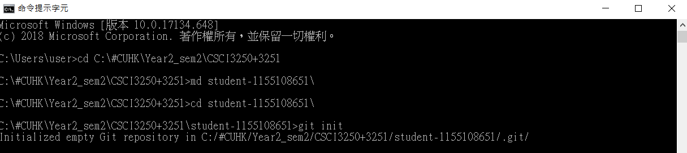
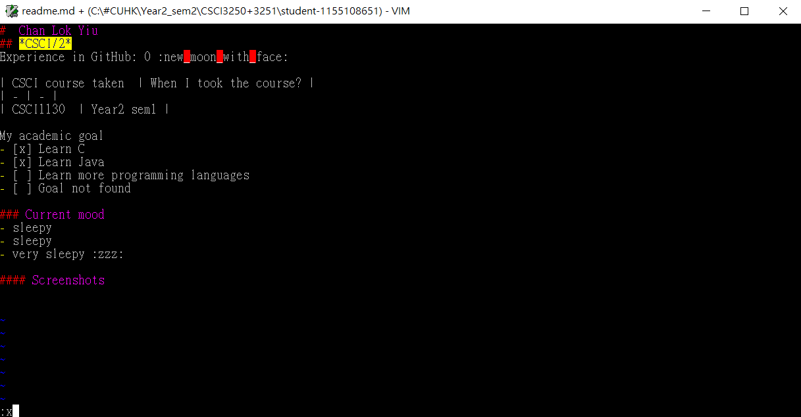

#  Chan Lok Yiu
## *CSCI/2*
Experience in GitHub: 0 :new_moon_with_face:

| CSCI course taken  | When I took the course? |
| - | - |
| CSCI1130  | Year2 sem1 |

My academic goal
- [x] Learn C
- [x] Learn Java
- [ ] Learn more programming languages
- [ ] Goal not found

### Current mood
- sleepy
- sleepy
- very sleepy :zzz:

#### Screenshots
Git init: 
Editing readme.md: 
Add and commit: 

